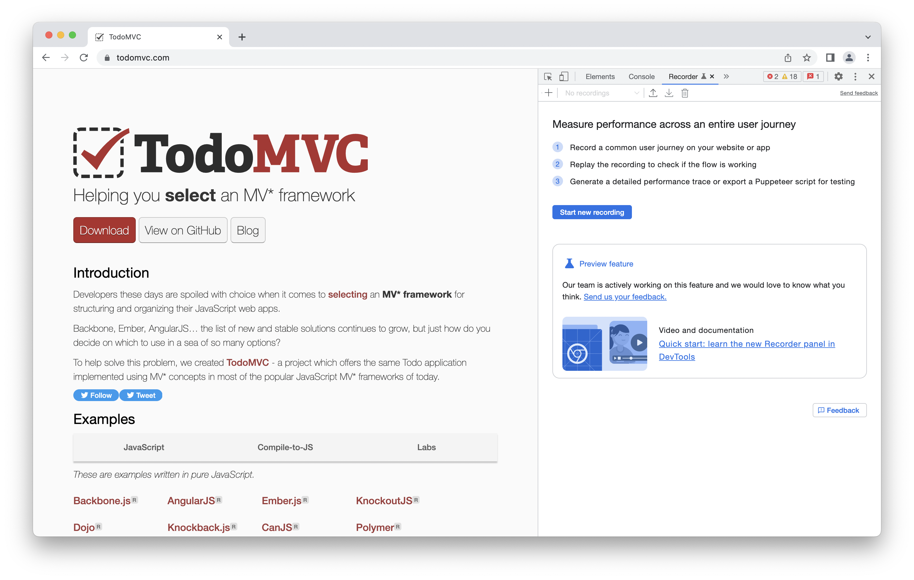
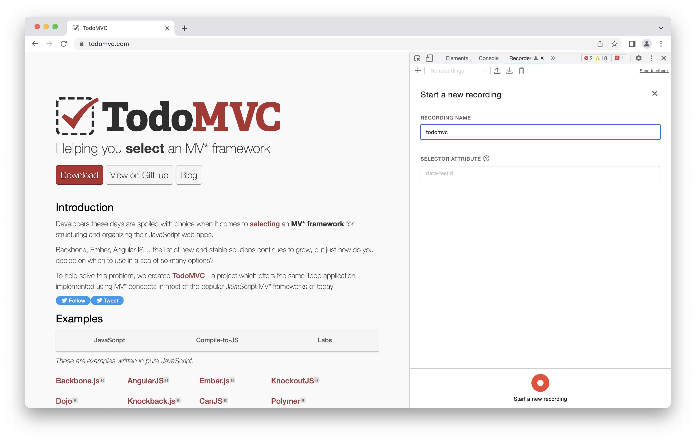
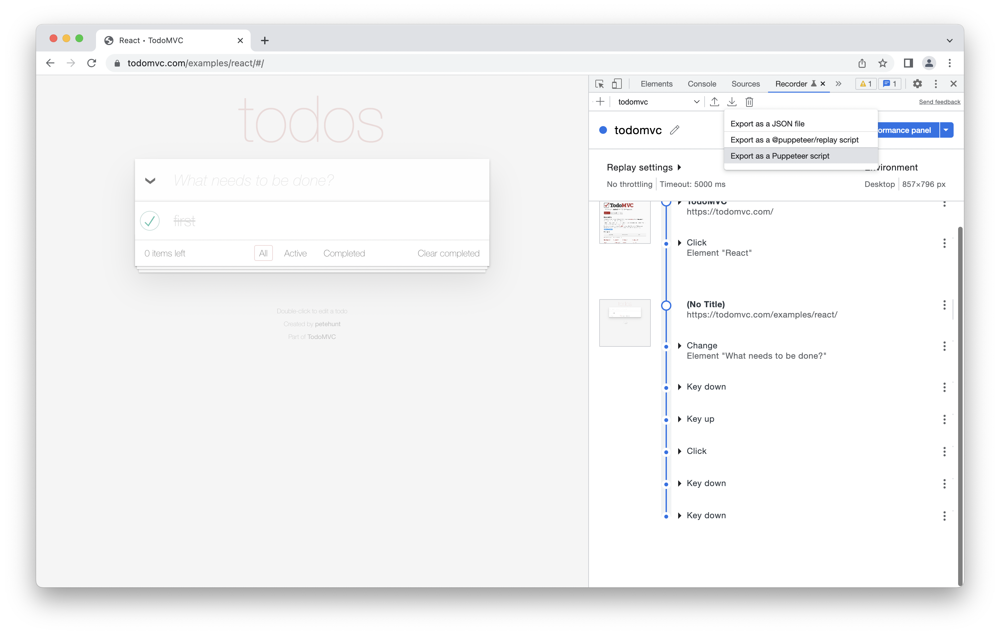

# puppeteer-recording-helpers

> Test helpers for playback of puppeteer recordings from Chrome Devtool Recorder.

E.g. for use with test frameworks like [mocha][], [jest][], [ava][], ...

# install 

````
npm init -y
npm install -D puppeteer puppeteer-recording-helpers
````

# usage 

1. open Chrome browser and open Developer Tools 
   - "CTRL + Shift + I" (Windows/ Linux)
   - "CMD + option + I" (Mac) 

2. open Tab "Recorder" and start recording
   

3. Execute your click flow...
   

3. Export as puppeteer script
   

4. Extract the click steps from the exported script and enhance with provided helpers.  

    ```js
    import { openBrowser } from 'puppeteer-recording-helpers'

    ;(async () => {

    const { browser, page, timeout } = openBrowser()
    const messages = consoleLog(page)

    // >>>snip>>> copy the contents from Chrome Devtools Recording
    {
      const targetPage = page
      await targetPage.setViewport({ width: 800, height: 600 })
    }
    {
      const targetPage = page
      const promises = []
      promises.push(targetPage.waitForNavigation())
      await targetPage.goto('https://todomvc.com/examples/react/#/')
      await Promise.all(promises)
    }
    // ...
    browser.close()
    // <<<snip<<<

    })()
    ```

    See `./test/todomvc.spec.js` for modified recording.

5. Run your tests

        npm test

# helpers

- [clearBrowserCache](./src/clearBrowserCache.js) - Clears browser cache, cookies and/or localStorage, sessionStorage
- [consoleLog](./src/consoleLog.js) - Collect and/or display browser console log statements and errors
- [findElements](./src/findElements.js) - Find elements using either CSS Selectors or xPath
- [findText](./src/findText.js) - Find text in page
- [handleElements](./src/handleElements.js) - Convert ElementHandle to element attributes
- [input](./src/input.js) - Fill in text into an input element
- [navigate](./src/navigate.js) - Navigates to an Url
- [openBrowser](./src/openBrowser.js) - Open a browser with one tab
- [openTab](./src/openTab.js) - Open a new tab
- [screenshot](./src/screenshot.js) - Take a screenshot
- [waitFor](./src/waitFor.js) - Wait for timeout in milliseconds
- [querySelectorAll](./src/puppeteerHelpers.js) - Helper used in puppeteer recordings 
- [querySelectorsAll](./src/puppeteerHelpers.js) - Helper used in puppeteer recordings 
- [scrollIntoViewIfNeeded](./src/puppeteerHelpers.js) - Helper used in puppeteer recordings 
- [waitForConnected](./src/puppeteerHelpers.js) - Helper used in puppeteer recordings 
- [waitForElement](./src/puppeteerHelpers.js) - Helper used in puppeteer recordings 
- [waitForFunction](./src/puppeteerHelpers.js) - Helper used in puppeteer recordings 
- [waitForInViewport](./src/puppeteerHelpers.js) - Helper used in puppeteer recordings 
- [waitForSelector](./src/puppeteerHelpers.js) - Helper used in puppeteer recordings 
- [waitForSelectors](./src/puppeteerHelpers.js) - Helper used in puppeteer recordings 

# license

[The Unlicense](https://unlicense.org)

# contributing

Any Pull-Request for fixing or enhancing the helpers is welcome.

# references 

- [puppeteer API][puppeteer]
- [ava][]
- [jest][]
- [mocha][]

[puppeteer]: https://pptr.dev/api
[mocha]: https://mochajs.org/
[ava]: https://github.com/avajs/ava
[jest]: https://jestjs.io/
